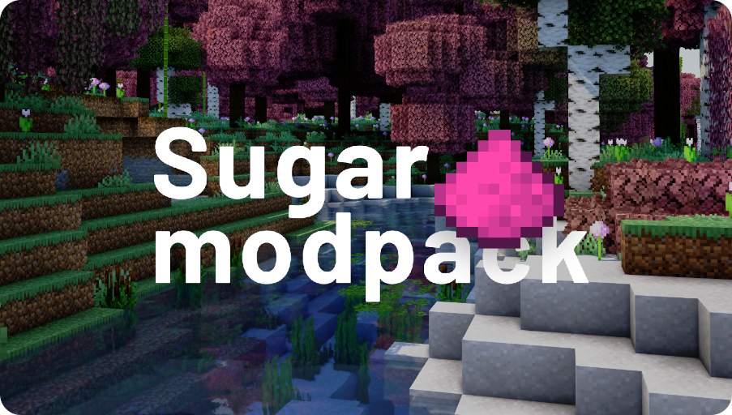

# 🍭 Sugar
### 🍬 Vanilla Minecraft modification package aimed at 🔥 Optimization with a sprinkling of 🚀 User Experience Improvements.

✨ This is a modpack that will make your game much more enjoyable and comfortable than you are used to.

🪄 This modpack gives you great performance on different configurations of personal computers, while allowing you to keep all the things you are so used to: *CTM*, *CIT*, *Capes*, *CEM*, *Zoom* and etc from **Optifine**.

🎀 We strive to make your Minecraft game **more immersive** by keeping and adhering to the ideas of the game itself without changing the internal mechanics and systems. 
Try to make the modpack accessible to everyone by **optimizing** game systems with well-known and popular modifications.

🎉 And all this is already available and ready to play, you only need to install modpack and enjoy your gameplay!

Thank you 💖 for being there and have a nice game!

## 📦 Resources
*\* resources that you can install in the assembly, the settings for these resources are already provided.*

> To use the supplied shader settings, use the Iris tools to import them:
> `BSL_v8.1.03.zip.txt`, `ComplementaryReimagined_r1.1.1.zip.txt`, `ComplementaryShaders_v4.5.1.zip.txt`, `ComplementaryShaders_v4.5.1_NS.zip.txt`, `Sildur's+Enhanced+Default+v1.131.zip.txt`

### Mods
+ [Animatica](https://github.com/FoundationGames/Animatica)
+ [AntiGhost](https://github.com/gbl/AntiGhost)
+ [C^2M](https://github.com/RelativityMC/C2ME-fabric)
+ [Fabric Capes](https://github.com/CaelTheColher/Capes)
+ [Custom Entity Models](https://github.com/dorianpb/cem)
+ [CITResewn](https://github.com/SHsuperCM/CITResewn)
+ [Cloth Config API](https://github.com/shedaniel/cloth-config)
+ [Colormatic](https://github.com/kvverti/colormatic)
+ [Continuity](https://github.com/PepperCode1/Continuity)
+ [CustomHUD](https://github.com/Minenash/CustomHUD)
+ [Dark Loading Screen](https://github.com/A5b84/dark-loading-screen)
+ [Don't Clear Chat History](https://github.com/emmods/DCCH)
+ [Debugify](https://github.com/isXander/Debugify)
+ [Dynamic FPS](https://github.com/juliand665/Dynamic-FPS)
+ [Enhanced Block Entities](https://github.com/FoundationGames/EnhancedBlockEntities)
+ [EntityCulling](https://github.com/tr7zw/EntityCulling)
+ [Entity Texture Features](https://github.com/Traben-0/Entity_Texture_Features)
+ [Fabric Language Kotlin](https://github.com/FabricMC/fabric-language-kotlin)
+ [FabricSkyboxes](https://github.com/AMereBagatelle/fabricskyboxes)
+ [FerriteCore](https://github.com/malte0811/FerriteCore)
+ [Indium](https://github.com/comp500/Indium)
+ [Iris](https://github.com/IrisShaders/Iris)
+ [Krypton](https://github.com/astei/krypton)
+ [LambDynamicLights](https://github.com/LambdAurora/LambDynamicLights)
+ [LazyDFU](https://github.com/astei/lazydfu)
+ [Lithium](https://github.com/CaffeineMC/lithium-fabric)
+ [Memory Leak Fix](https://github.com/fxmorin/memoryLeakFix)
+ [Mod Menu](https://github.com/TerraformersMC/ModMenu)
+ [More Culling](https://github.com/fxmorin/moreculling)
+ [Not Enough Crashes](https://github.com/natanfudge/Not-Enough-Crashes)
+ [Ok Zoomer](https://github.com/EnnuiL/OkZoomer)
+ [Presence Footsteps](https://github.com/Sollace/Presence-Footsteps)
+ [Quilt Standard Libraries](https://github.com/QuiltMC/quilt-standard-libraries)
+ [Reese's Sodium Options](https://github.com/FlashyReese/reeses-sodium-options)
+ [Smooth Boot](https://github.com/UltimateBoomer/mc-smoothboot)
+ [Sodium Extra](https://github.com/FlashyReese/sodium-extra-fabric)
+ [Sodium](https://github.com/CaffeineMC/sodium-fabric/)
+ [Sound Physics Remastered](https://github.com/henkelmax/sound-physics-remastered)
+ [Starlight](https://github.com/PaperMC/Starlight)
+ [thorium](https://github.com/PotassiumMC/thorium)
+ [YOSBR](https://github.com/shedaniel/your-options-shall-be-respected)

### Resource packs
+ [Default Dark Mode](https://github.com/xnebulr/Minecraft-Default-Dark-Mode)
+ [xali's Enhanced Biomes: River & Pond](https://github.com/xalixilax/xali-s-Enhanced-Biome-River-And-Pond-16x)
+ [xali's Enchanted Books](https://github.com/xalixilax/xali-s-Enchanted-Books-16x)
+ [xali's Enhanced Jungle Wood](https://www.curseforge.com/minecraft/texture-packs/xalis-enhanced-jungle-wood)
+ [xali's Enhanced Vanilla](https://github.com/xalixilax/xali-s-Enhanced-Vanilla-16x)
+ [xali's Potions](https://www.curseforge.com/minecraft/texture-packs/xalis-potions)

### Shader packs configurations
+ [*BSL Shaders](https://www.curseforge.com/minecraft/customization/bsl-shaders)
+ [*Complementary Shaders](https://www.curseforge.com/minecraft/customization/complementary-shaders)
+ [*Complementary Reimagined](https://www.curseforge.com/minecraft/customization/complementary-reimagined)
+ [*Sildur's Enhanced Default](https://www.curseforge.com/minecraft/customization/sildurs-enhanced-default)

## 📌 Additional
### Classification of versions
The version of the modpack is defined relative 
to the version of Minecraft on which this build will run.
This is done to make it easier to pick up 
and determine the version of the modpack for your version of the game.

The version scheme can be represented in `X.Y.Z`, 
where `X` is the number of Minecraft minor releases, 
and `Y` is the number of version patches. 
`Z`, on the other hand, is used as the patches for the build itself.

The `X` countdown starts with Minecraft version 1.17. 
At the moment the build is running on Minecraft 1.18.2 and has version 2.2.5